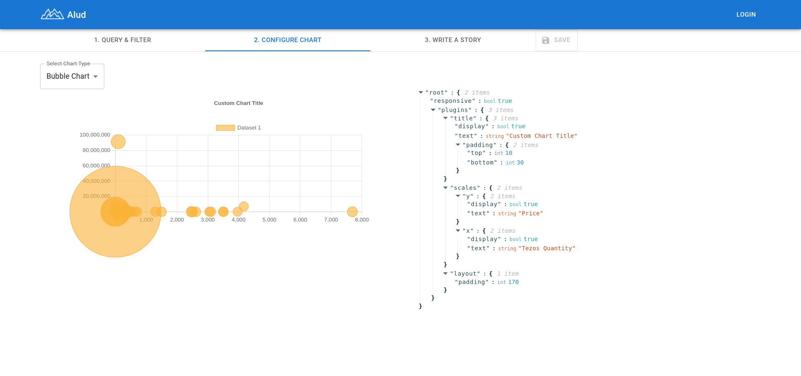

# Alud

Story telling for the tezos Blockchain using the dipdup indexers.


## Setup

Clone the repository and enter the alud directory.

```
git clone https://github.com/zoek1/alud.git
cd alud
```

This project requires [docker-compose](https://docs.docker.com/compose/install/linux/) for easy testing and deployment.

## Run

Run docker-compose, the first time it will take a while because is building the images.

```
docker-compose up
```

On your browser open [http://localhost:3000](http://localhost:3000)


## Backlog

- [X] Add support to query dipdup graphql endpoint
- [X] Integrate graphiql and the graphiql explorer to speed the query design process
- [X] Integrate JSONata to support selection and aggregation on indexed data.
- [X] Integrate charts.js to display the filtered data.
- [X] Integrate markdown editor to explain motivation behind the charts
- [X] Save charts in the servers.
- [X] Display all created charts.
- [ ] Add support for dashboards

## Create a new tezos Viz

1. Query and filter data available in the dipdup indexer


2. Select the chart type and customize it


3. Write some story or context about your chart


4. Save it! 

## Demo

https://www.loom.com/share/daa987b8bc7447a085faf6b73e6d2a36

## License

See [LICENSE](LICENSE.md).
